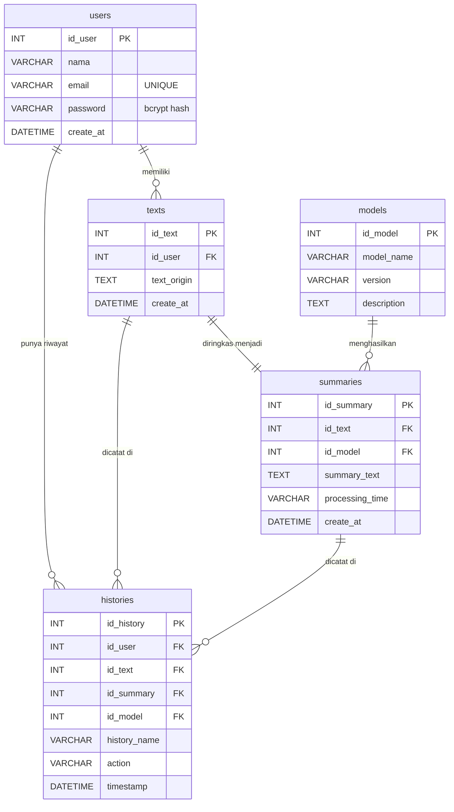

# ARCHITECTURE.md — QuickSum.AI

> Dokumentasi teknis ini ditujukan untuk developer baru yang bergabung ke proyek QuickSum.AI. Bacalah dari atas ke bawah untuk memahami arsitektur, cara menjalankan proyek, dan cara berkontribusi.

---

## Daftar Isi

1. [Ringkasan Proyek & Arsitektur](#1-ringkasan-proyek--arsitektur)
2. [Panduan Memulai (Getting Started)](#2-panduan-memulai-getting-started)
3. [Alur Utama & Referensi API](#3-alur-utama--referensi-api)
4. [Panduan Kontribusi & Testing](#4-panduan-kontribusi--testing)

---

## 1. Ringkasan Proyek & Arsitektur

### 1.1 Deskripsi Proyek

**QuickSum.AI** adalah aplikasi web untuk meringkas teks panjang secara otomatis menggunakan kecerdasan buatan. Pengguna dapat menempelkan teks bebas atau mengunggah dokumen `.txt`/`.pdf`, memilih panjang ringkasan (pendek/sedang/panjang), dan menerima ringkasan yang dihasilkan oleh model bahasa besar (LLM) dalam hitungan detik.

### 1.2 Arsitektur Sistem

Proyek ini menggunakan **Three-Service Architecture** yang dipisahkan secara jelas berdasarkan tanggung jawabnya:

```
┌─────────────────────────────────────────────────────────────────┐
│                        USER'S BROWSER                           │
│                                                                 │
│   ┌────────────────────────────────────────────────────────┐    │
│   │     FRONTEND  (React + Vite)  — port 5173              │    │
│   │   SummarizeForm → useSummarize → api.js (Axios)        │    │
│   └────────────────────┬───────────────────────────────────┘    │
└────────────────────────┼────────────────────────────────────────┘
                         │  POST /api/summarize
                         │  { text, length }
                         ▼
┌────────────────────────────────────────────────────────────────┐
│        NODE BACKEND  (Express.js + Sequelize)  — port 3000     │
│                                                                │
│  Routes → Middleware (validate/auth) → Controller → Service    │
│                         │                                      │
│               Simpan ke MySQL DB                               │
└────────────────────────┬───────────────────────────────────────┘
                         │  POST /summarize
                         │  { text, length }
                         ▼
┌────────────────────────────────────────────────────────────────┐
│          AI BACKEND  (FastAPI + Uvicorn)  — port 8000          │
│                                                                │
│    Router → ai_service.py → OpenRouter API (GLM-4.5-Air)      │
└────────────────────────────────────────────────────────────────┘
```

**Pola Arsitektur yang Digunakan:**
- **Frontend**: Component-Based Architecture (React) + Custom Hooks untuk pemisahan logika
- **Node Backend**: MVC (Model-View-Controller) dengan layer middleware dan service
- **AI Backend**: Router-Service Pattern (FastAPI)

### 1.3 Struktur Folder

```
Quicksum_ai/                        <- Root repositori
│
├── frontend/                       <- Aplikasi React (Vite)
│   ├── index.html                  <- Entry point HTML
│   └── src/
│       ├── main.jsx                <- Bootstrap React ke DOM
│       ├── App.jsx                 <- Root component (header, main, footer)
│       ├── components/             <- UI components (presentational)
│       │   ├── SummarizeForm.jsx   <- Form utama (input teks + tab upload)
│       │   ├── FileUpload.jsx      <- Drag-and-drop + PDF.js parser
│       │   ├── OutputArea.jsx      <- Tampilan hasil ringkasan
│       │   ├── LoadingSpinner.jsx  <- Indikator loading
│       │   ├── ThemeToggle.jsx     <- Toggle dark/light mode
│       │   └── ToastNotification.jsx
│       ├── hooks/                  <- Custom React hooks (business logic)
│       │   ├── useSummarize.js     <- State & API call summarization
│       │   └── useClipboard.js     <- Copy-to-clipboard logic
│       ├── services/
│       │   └── api.js              <- Axios instance terpusat
│       └── styles/
│           └── index.css           <- Design tokens + global styles
│
├── backend/
│   ├── node-backend/               <- REST API (Express.js)
│   │   ├── server.js               <- Entry point: middleware, routes, DB sync
│   │   ├── config/database.js      <- Konfigurasi koneksi Sequelize
│   │   ├── routes/                 <- Definisi URL endpoint
│   │   │   ├── index.js            <- Route aggregator (/api/*)
│   │   │   ├── authRoutes.js       <- /api/auth/*
│   │   │   ├── summaryRoutes.js    <- /api/summarize
│   │   │   ├── historyRoutes.js    <- /api/history
│   │   │   └── modelRoutes.js      <- /api/models
│   │   ├── controllers/            <- Request handler logic
│   │   │   ├── authController.js
│   │   │   ├── summaryController.js
│   │   │   ├── historyController.js
│   │   │   └── modelController.js
│   │   ├── middlewares/
│   │   │   ├── authMiddleware.js   <- Verifikasi JWT Bearer token
│   │   │   ├── validateMiddleware.js <- Validasi required fields
│   │   │   └── errorMiddleware.js  <- Global Express error handler
│   │   ├── models/                 <- Sequelize ORM models (MySQL tables)
│   │   │   ├── Index.js            <- Import model + definisi relasi
│   │   │   ├── User.js, Text.js, Summary.js, History.js, AI_Model.js
│   │   ├── services/
│   │   │   └── aiService.js        <- HTTP call ke AI Backend (FastAPI)
│   │   └── utils/
│   │       ├── responseHandler.js  <- successResponse / errorResponse
│   │       └── logger.js           <- logInfo / logError dengan timestamp
│   │
│   └── ai-backend/                 <- Layanan AI (FastAPI + Python)
│       ├── run.py                  <- Entry point: jalankan Uvicorn
│       └── app/
│           ├── main.py             <- FastAPI app instance + router
│           ├── core/config.py      <- Load env vars (API_KEY, BASE_URL)
│           ├── routes/summarize.py <- POST /summarize endpoint
│           ├── models/schema.py    <- Pydantic request/response schema
│           └── services/ai_service.py <- Kirim prompt ke OpenRouter API
│
├── design-system/
│   └── quicksum.ai/MASTER.md       <- Panduan desain otoritatif
│
├── vite.config.js                  <- Konfigurasi Vite (root = ./frontend)
├── package.json                    <- Root package (frontend dependencies)
├── eslint.config.js                <- Konfigurasi ESLint
└── AGENTS.md                       <- Panduan untuk AI coding agents
```

### 1.4 Tech Stack Lengkap

#### Frontend
| Teknologi | Versi | Fungsi |
|---|---|---|
| **React** | `^19` | UI framework berbasis komponen |
| **Vite** | `^8` | Build tool & dev server (HMR) |
| **Tailwind CSS** | `^4` | Utility-first CSS (terpasang, belum digunakan aktif) |
| **Axios** | `^1.17` | HTTP client ke Node backend |
| **pdfjs-dist** | `^5` | Parsing teks dari PDF biner di browser |

#### Node Backend
| Teknologi | Versi | Fungsi |
|---|---|---|
| **Express.js** | `^5` | HTTP server & routing |
| **Sequelize** | `^6` | ORM untuk MySQL/MariaDB |
| **mysql2** | `^3` | Driver MySQL |
| **jsonwebtoken** | `^9` | Generate & verifikasi JWT |
| **bcrypt** | `^6` | Hashing password (salt rounds: 10) |
| **cors** | `^2` | Middleware CORS |
| **dotenv** | `^17` | Memuat environment variables |
| **nodemon** | `^3` | Auto-restart server saat dev |

#### AI Backend
| Teknologi | Fungsi |
|---|---|
| **FastAPI** | Async Python web framework |
| **Uvicorn** | ASGI server untuk FastAPI |
| **Pydantic** | Validasi request/response schema |
| **requests** | HTTP call ke OpenRouter API |
| **python-dotenv** | Memuat env vars dari `.env` |

---

## 2. Panduan Memulai (Getting Started)

### 2.1 Prasyarat Sistem

| Software | Versi Minimum |
|---|---|
| **Node.js** | v18+ |
| **Python** | v3.9+ |
| **MySQL** | v8.0 |
| **Docker** *(opsional)* | v24+ |

```bash
node --version    # harus v18+
python --version  # harus v3.9+
mysql --version   # harus v8.0+
```

### 2.2 Langkah Instalasi

**Langkah 1: Clone Repositori**
```bash
git clone <repository-url>
cd Quicksum_ai
```

**Langkah 2: Install Dependensi Frontend**
```bash
# Dari root repositori
npm install
```

**Langkah 3: Install Dependensi Node Backend**
```bash
cd backend/node-backend
npm install
```

**Langkah 4: Setup AI Backend (Python)**
```bash
cd backend/ai-backend

# Buat virtual environment
python -m venv venv

# Aktifkan venv
# Windows:   venv\Scripts\activate
# macOS/Linux: source venv/bin/activate

pip install -r requirements.txt
```

**Langkah 5: Buat Database MySQL**
```sql
CREATE DATABASE IF NOT EXISTS project_summary
  CHARACTER SET utf8mb4
  COLLATE utf8mb4_unicode_ci;
```

### 2.3 Konfigurasi Environment Variables

**Frontend** — buat `Quicksum_ai/.env.local`:
```env
VITE_API_BASE_URL=http://localhost:3000
```

**Node Backend** — buat `backend/node-backend/.env`:
```env
PORT=3000
NODE_ENV=development

DB_HOST=localhost
DB_USER=root
DB_PASSWORD=your_mysql_password
DB_NAME=project_summary
DB_PORT=3306

# String acak panjang, minimal 32 karakter
JWT_SECRET=ganti_dengan_secret_yang_sangat_panjang_dan_aman

AI_BACKEND_URL=http://localhost:8000/summarize
```

**AI Backend** — buat `backend/ai-backend/.env`:
```env
# Dapatkan dari https://openrouter.ai/keys
OPENROUTER_API_KEY=sk-or-v1-xxxxxxxxxxxxxxxxxxxxxxxxxxxxxxxxxxxx
```

> **PERINGATAN**: Jangan pernah commit file `.env` ke Git. Pastikan sudah ada di `.gitignore`.

### 2.4 Menjalankan Proyek (Development)

Buka **3 terminal terpisah**:

```bash
# Terminal 1 — Frontend (http://localhost:5173)
npm run dev

# Terminal 2 — Node Backend (http://localhost:3000)
cd backend/node-backend
npm run dev

# Terminal 3 — AI Backend (http://localhost:8000)
cd backend/ai-backend
# (aktifkan venv lebih dulu)
python run.py
```

### 2.5 Menjalankan via Docker (Node Backend + MySQL)

```bash
cd backend/node-backend

docker-compose up --build        # Build dan jalankan
docker-compose up -d --build     # Mode background
docker-compose down              # Hentikan container
docker-compose down -v           # Hentikan + hapus volume DB
```

> **Catatan**: AI Backend harus tetap dijalankan secara manual di luar Docker.

---

## 3. Alur Utama & Referensi API

### 3.1 Alur Kerja Utama (Happy Path)

```
User
 → [Tempel teks / Upload .txt atau .pdf]
 → [Pilih panjang: pendek | sedang | panjang]
 → [Klik "Ringkas Sekarang"]
 → Frontend: POST /api/summarize { text, length }
 → Node Backend: validasi body → proxy ke AI Backend
 → AI Backend: bangun prompt → panggil OpenRouter (GLM-4.5-Air)
 → OpenRouter: kembalikan teks ringkasan
 → Node Backend → Frontend: tampilkan di OutputArea
```

### 3.2 Referensi API — Node Backend (Port 3000)

Semua endpoint diawali prefix `/api`.

---

#### `POST /api/auth/register` — Daftar pengguna baru

*Request Body:*
```json
{ "nama": "Budi Santoso", "email": "budi@example.com", "password": "rahasia123" }
```
*Response `201`:*
```json
{ "status": "success", "message": "Registrasi berhasil.", "data": { "id_user": 1, "nama": "Budi Santoso", "email": "budi@example.com" } }
```

---

#### `POST /api/auth/login` — Login, dapatkan JWT token

*Request Body:*
```json
{ "email": "budi@example.com", "password": "rahasia123" }
```
*Response `200`:*
```json
{ "status": "success", "token": "eyJhbGciOi...", "data": { "id_user": 1, "nama": "Budi Santoso" } }
```

---

#### `POST /api/summarize` — Ringkas teks

> Auth tidak wajib saat ini. Hasil belum otomatis tersimpan ke DB (backlog).

*Request Body:*
```json
{ "text": "Teks panjang minimal 50 karakter...", "length": "sedang" }
```

> Nilai valid `length`: `"pendek"` | `"sedang"` | `"panjang"`

*Response `200`:*
```json
{ "summary": "Teks ringkasan yang dihasilkan AI..." }
```
*Response `400` (validasi gagal):*
```json
{ "status": "error", "message": "Data tidak lengkap. Kolom berikut wajib diisi: text, length" }
```

---

#### `GET /api/history` — Riwayat ringkasan user

| Header | Nilai |
|---|---|
| `Authorization` | `Bearer <jwt_token>` (Wajib) |

*Response `200`:*
```json
{
  "status": "success",
  "data": [{
    "id_history": 1,
    "timestamp": "2026-07-10T10:00:00.000Z",
    "Text": { "text_origin": "..." },
    "Summary": { "summary_text": "...", "AI_Model": { "model_name": "GLM-4.5-Air" } }
  }]
}
```

---

#### `GET /api/models` — Daftar model AI tersedia

| Header | Nilai |
|---|---|
| `Authorization` | `Bearer <jwt_token>` (Wajib) |

*Response `200`:*
```json
{ "status": "success", "data": [{ "id_model": 1, "model_name": "GPT-3.5 Turbo", "version": "1.0" }] }
```

---

### 3.3 Referensi API — AI Backend (Port 8000)

> Swagger UI otomatis: **http://localhost:8000/docs**

#### `POST /summarize` — Endpoint internal (dipanggil Node Backend)

*Request Body:*
```json
{ "text": "Teks yang akan diringkas...", "length": "sedang" }
```
*Response `200`:*
```json
{ "summary": "Hasil ringkasan dari LLM..." }
```

---

### 3.4 Peta Komponen Frontend

```
App.jsx
├── <header>
│   └── ThemeToggle.jsx          ← Toggle dark/light, simpan ke localStorage
└── <main>
    └── SummarizeForm.jsx        ← Form utama; menggunakan useSummarize hook
        ├── [Tab: Ketik Teks]
        │   └── <textarea>       ← Input teks + gauge indikator min 50 char
        ├── [Tab: Unggah File]
        │   └── FileUpload.jsx   ← Drag-and-drop + input file + PDF.js parser
        ├── [Pilihan Panjang]    ← Toggle: Pendek / Sedang / Panjang
        ├── <button> Submit      ← Nonaktif jika < 50 char atau sedang loading
        └── OutputArea.jsx       ← Hasil ringkasan, tombol salin & unduh .txt
```

#### State Management

QuickSum.AI menggunakan **React built-in state** (tanpa Redux/Zustand). Semua state dikelola via Custom Hooks:

| Hook | State yang Dikelola |
|---|---|
| `useSummarize` | `result`, `isLoading`, `error`, `loadingMessage` |
| `useClipboard` | `copied` (feedback copy-to-clipboard) |
| `ThemeToggle` (internal) | `theme` (`"light"` / `"dark"`) via `localStorage` |
| `FileUpload` (internal) | `zoneState`, `fileInfo`, `error` |

---

### 3.5 Skema Database (MySQL)



---

## 4. Panduan Kontribusi & Testing

### 4.1 Perintah Linting

```bash
# Jalankan ESLint untuk seluruh proyek frontend
npm run lint

# Cek file tertentu
npx eslint frontend/src/components/SummarizeForm.jsx

# Cek style Python (AI Backend)
cd backend/ai-backend
pip install flake8
flake8 app/
```

Rule ESLint yang aktif: `js.configs.recommended`, `reactHooks.configs.flat.recommended`, `no-unused-vars`.

### 4.2 Pengujian Manual via cURL

```bash
# 1. Register
curl -X POST http://localhost:3000/api/auth/register \
  -H "Content-Type: application/json" \
  -d '{"nama":"Test User","email":"test@test.com","password":"password123"}'

# 2. Login (salin token dari response)
curl -X POST http://localhost:3000/api/auth/login \
  -H "Content-Type: application/json" \
  -d '{"email":"test@test.com","password":"password123"}'

# 3. Ringkas teks
curl -X POST http://localhost:3000/api/summarize \
  -H "Content-Type: application/json" \
  -d '{"text":"Teks yang sangat panjang untuk diringkas oleh AI QuickSum...","length":"pendek"}'

# 4. Ambil riwayat (ganti TOKEN)
curl http://localhost:3000/api/history \
  -H "Authorization: Bearer TOKEN"

# 5. Cek kesehatan layanan
curl http://localhost:3000/   # {"message":"Welcome to AI Summary Backend API!"}
curl http://localhost:8000/   # {"status":"AI Server is running"}
```

### 4.3 Alur Git & Branching

| Tipe | Format Branch | Contoh |
|---|---|---|
| Fitur baru | `feature/<nama>` | `feature/pdf-upload-fix` |
| Bug fix | `fix/<nama>` | `fix/cors-origin-whitelist` |
| Hotfix prod | `hotfix/<deskripsi>` | `hotfix/db-alter-disable` |
| Dokumentasi | `docs/<topik>` | `docs/update-architecture` |
| Refaktorisasi | `refactor/<komponen>` | `refactor/summary-controller` |

```bash
git checkout main && git pull origin main
git checkout -b feature/nama-fitur-anda
# ... buat perubahan ...
git commit -m "feat: tambahkan validasi password minimum 8 karakter"
git push origin feature/nama-fitur-anda
# Buat Pull Request ke main
```

**Format Pesan Commit (Conventional Commits):**

| Prefix | Digunakan Untuk |
|---|---|
| `feat:` | Fitur baru |
| `fix:` | Memperbaiki bug |
| `docs:` | Perubahan dokumentasi |
| `refactor:` | Refaktorisasi tanpa perubahan fungsional |
| `test:` | Menambah/memperbaiki test |
| `chore:` | Update dependensi, build config |

### 4.4 Standar Penulisan Kode

**Frontend (React)**
- Gunakan **functional components** dan React Hooks
- Simpan **logika bisnis & state** di `src/hooks/`
- Simpan **semua HTTP request** di `src/services/api.js`
- Gunakan **CSS variables** dari `index.css` — jangan hardcode nilai warna
- Semua token warna **WAJIB** mengacu ke `design-system/quicksum.ai/MASTER.md`
- Semua elemen interaktif harus punya `cursor: pointer` dan `aria-label`

**Node Backend (Express.js)**
- Logika bisnis di `services/` — bukan di `routes/` atau `controllers/`
- Gunakan `utils/responseHandler.js` untuk semua response
- Gunakan `utils/logger.js` — jangan pakai `console.log` langsung di production
- Error dari controller harus dilempar ke `next(error)`
- Jangan hardcode nilai konfigurasi — selalu pakai `process.env`

**AI Backend (Python)**
- Routing di `app/routes/`, logika AI di `app/services/`
- Config & env vars hanya di `app/core/config.py`
- Semua schema menggunakan Pydantic `BaseModel`

---

> **CATATAN PENTING**:
> - Baca `AGENTS.md` sebelum memulai — file ini adalah panduan singkat dan otoritatif.
> - Jangan jalankan `sequelize.sync({ alter: true })` di production — gunakan Sequelize Migrations.
> - Swagger UI tersedia di `http://localhost:8000/docs` untuk test AI Backend.

---

*Dokumentasi ini di-generate pada: 2026-07-10 | Versi Proyek: 0.0.0*
